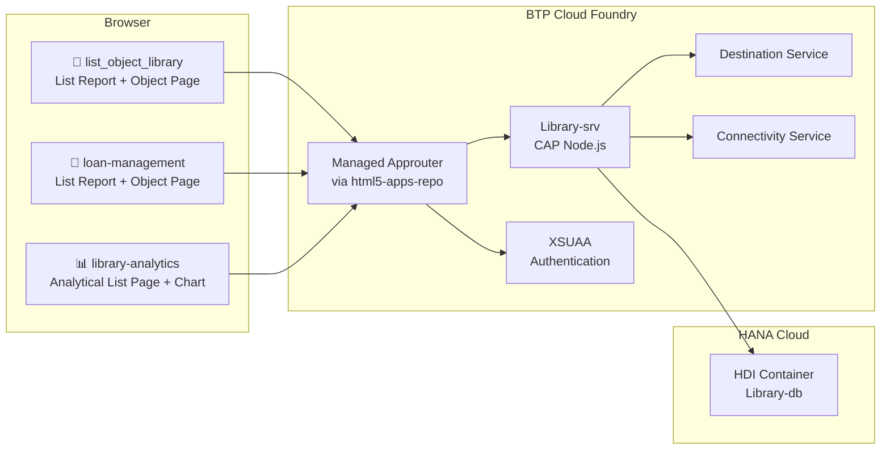

# 📚 Library — A BTP Full-Stack Learning Project

> A SAP BTP CAP project exploring CAPM, Fiori Elements, UI5, CDS, OData V4,
> HANA Cloud, XSUAA, and adjacent BTP services — built as a hands-on portfolio
> artifact while learning the SAP cloud stack end-to-end.


---

## 📑 Table of Contents

1. [Project e](#-architecture)
3. Features Implemented
4. #-quick-start
5. [Project Structure](#-project-structure)
6. Testing
7. #-what-i-learned
8. [Roadmap &Known Issues
9. #-credits

---

## 🎯 Project Overview

**Domain:** A simplified library system — Authors, Books, Categories, Tags, 
Discounts, Profns).

**Why this project:**
- Cover the full SAP BTP application development surface in one repo
- Exercise CAP features beyond beginner tutorials (custom actions, virtual 
  fields, calculated elements, analytics annotations, value helps, drafts)
- Demonstrate multiple Fiori Elements floorplans + freestyle UI5 readiness
- Document hands-on findings with Joule, V4 compatibility, and BTP trial 
  workflows

**Project status:** 🟡 Active learning sandbox — not a production app.

---

## 🏗️ Architecture



---

## ✨ Features Implemented

### Backend — CAP / CDS / OData V4

| Feature | Status | Where |
|---|---|---|
| 11 entities across 2 namespaces (`smart.library`, `smart.library.Lending`, `smart.library.Sales`) | ✅ | `db/schema.cds` |
| Reusable types (`Price`, `BusinessID`, `StockQty`, `GenreType`, enums) | ✅ | `db/schema.cds` |
| Structured types (`Address`) | ✅ | `db/schema.cds` |
| Custom aspects (`AuditInfo`) + built-in (`cuid`, `managed`) | ✅ | `db/schema.cds` |
| Compositions & Associations (with backreferences) | ✅ | `db/schema.cds` |
| Calculated elements (`availability` via `case` expression) | ✅ | `db/schema.cds` |
| Nested context (`Sales.Orders`, `Lending.Members`, `Lending.Loans`) | ✅ | `db/schema.cds` |
| CDS views (`BooksWithAuthor`) | ✅ | `db/schema.cds` |
| Bound actions (`restock`, `applyDiscount`) | ✅ | `srv/cat-service.cds` + `.js` |
| Unbound action (`resetAllStock`) | ✅ | `srv/cat-service.cds` + `.js` |
| Functions (`getTotalBooks`, `getExpensiveBooks`, `getBookCountByGenre`) | ✅ | `srv/cat-service.cds` + `.js` |
| Virtual fields (`effectivePrice` computed at read-time) | ✅ | `srv/cat-service.cds` + `.js` |
| Analytics annotations (`@Aggregation.ApplySupported`, `@Analytics.AggregatedProperty`, dimensions + measures) | ✅ | `db/schema.cds` |
| CSV seed data for all entities | ✅ | `db/data/` |

### Frontend — 3 Fiori Apps + 1 Documented Dead-End

| App | Floorplan | OData | Notes |
|---|---|---|---|
| `list_object_library` | List Report + Object Page | V4 | Books + Authors browsing, applyDiscount + restock action buttons, effectivePrice display |
| `loan-management` | List Report + Object Page | V4 | Joule-generated, lending records (members borrowing books) |
| `library-analytics` | Analytical List Page | V4 | Chart + filterable analytical table, "Stock by Genre" column chart with `DynamicMeasures` |
| `library-overview` | Overview Page | V4 (broken) | 🚫 Intentionally kept as broken — see [library-overview/README.md](app/library-overview/README.md) for the lesson |

### BTP Integration

| Service | Bound | In Use |
|---|---|---|
| XSUAA (`Library-auth`) | ✅ | Auth instance configured, role model pending |
| HANA Cloud (`Library-db`) | ✅ | Primary data store |
| HTML5 Apps Repo (`Library-html5-service`) | ✅ | Hosts UI apps (managed approuter pattern) |
| Destination Service (`Library-destination-service`) | ✅ | UI5 CDN destination only |
| Connectivity Service (`Library-connectivity`) | ⚠️ | Bound but unused |

---

## 🚀 Quick Start

### Prerequisites

- Node.js 18+
- `@sap/cds-dk` globally installed (`npm i -g @sap/cds-dk`)
- BAS dev space OR local environment
- (Optional) BTP trial account with CF org/space for cloud deploy

### Local Development

```bash
git clone https://github.com/dhruv37502005/Library.git
cd Library
npm install

# Run all apps locally with hot reload + sqlite in-memory
cds watch
```

App URLs (local):
- Backend metadata: `http://localhost:4004/odata/v4/cat/$metadata`
- list_object_library: `http://localhost:4004/list_object_library/index.html`
- loan-management: `http://localhost:4004/loanmanagement/index.html`
- library-analytics: `http://localhost:4004/library-analytics/index.html`

### Available npm Scripts

| Script | Purpose |
|---|---|
| `npm start` | Production start (post-build) |
| `npm run watch` | Local dev with hot reload |
| `npm run watch:hybrid` | Local dev pointing to HANA Cloud via `.env` |
| `npm run debug` | Watch + Node inspector on port 9229 |
| `npm run debug:break` | Same, paused on first line |
| `npm run build` | MTA build → `mta_archives/archive.mtar` |
| `npm run deploy` | Deploy MTAR to Cloud Foundry |
| `npm run undeploy` | Tear down CF deployment + services |

### Reset-Recovery (BTP Trial)

After every 30-day BTP trial reset, run:

```bash
# 1. Re-bind hybrid binding
cds bind -2 Library,Library-auth

# 2. Rebuild and deploy
npm run build
npm run deploy

# 3. Reassign role collections in BTP cockpit (manual)
```

> 📦 **TODO**: Automate this via `.reset-recovery/bootstrap.sh` script
> (tracked in [Roadmap](#-roadmap--known-issues)).

---

## 📁 Project Structure

```
Library/
├── app/                          # Fiori apps (workspaces)
│   ├── list_object_library/      # LROP — Books + Authors
│   ├── loan-management/          # LROP — Loans (Joule-generated)
│   ├── library-analytics/        # ALP — Charts + analytical table
│   └── library-overview/         # 🚫 Documented broken OVP
├── db/
│   ├── schema.cds                # All entities, types, aspects, views
│   └── data/                     # CSV seed data
├── srv/
│   ├── cat-service.cds           # Service definition (CatService)
│   ├── cat-service.js            # Custom handlers
│   └── cat-service-ui.cds        # UI annotations for list_object_library
├── xs-security.json              # XSUAA config (auth model pending)
├── mta.yaml                      # MTA deploy descriptor
├── package.json                  # Workspaces + scripts
├── test.http                     # REST test suite
└── README.md                     # This file
```

---

## 🧪 Testing

### REST API
- Comprehensive `test.http` file at repo root
- CRUD + actions + functions + negative tests
- Seed UUIDs are stable across resets (sourced from CSVs)

### UI
- Open `cds watch` → navigate to app URLs above
- Manual smoke tests for each Fiori app
- Automated UI tests scaffolded but not yet wired

---

## 🎓 What I Learned

This section documents real findings — including failed attempts — from 
building this project. The dead-ends matter as much as the wins.

<details>
<summary><strong>🤖 Joule in SAP Build Code — Real-world Limits (click to expand)</strong></summary>

| Finding | Detail |
|---|---|
| **Joule is command-driven, not free-chat** | The chat panel requires a `/` command. Without one, prompts are ignored. |
| **No `/extend-cds` command** | Joule does not edit existing CDS files via chat. Schema edits must be manual. |
| **`/fiori-gen-cap-ui` requires existing service** | The command refuses to generate entities — only UI on top of already-exposed entities. |
| **65% solution, not 100%** | Auto-generated annotations need polish: wrong `using` imports, missing requested columns, ValueList shows lexical-first fields instead of semantically meaningful ones, raw field names as Labels. |
| **Right workflow** | Hand-write schema + service, then use Joule for UI generation. Treat Joule output as a draft, always review. |

</details>

<details>
<summary><strong>📊 V4 vs V2 Fiori Floorplan Compatibility</strong></summary>

| Floorplan | OData V4 Status | Action Taken |
|---|---|---|
| List Report + Object Page | ✅ Full V4 | Used for 2 apps |
| Worklist | ✅ Full V4 | Not used yet |
| Overview Page (OVP) | ❌ **Broken — sap.ovp is V2-only** | Kept broken folder as [documented lesson](app/library-overview/README.md) |
| Analytical List Page (ALP) | ⚠️ Needs aggregation annotations | Added `@Aggregation.ApplySupported` + `AggregatedProperty` to Books, then ALP worked |
| Custom Page | ✅ Full V4 | Not used yet |

**Key takeaway:** Fiori generators don't warn about V4 incompatibility. 
The tooling cheerfully generates broken apps. Verify floorplan compatibility 
before scaffolding.

</details>

<details>
<summary><strong>💸 Discount Architecture — Avoiding the Compound Bug</strong></summary>

Original (buggy) design overwrote `Books.price` on every discount:
- Discounting 20% twice → 36% off (compound), not 20%
- No way to un-discount (original price lost)
- No audit trail

Refactored design:
- `Books.price` is the canonical base price, never mutated
- Discounts are separate rows in `Discounts` entity with validity windows
- A virtual `effectivePrice` field on Books computes the current effective price at read-time via `after('READ')` handler
- Active discount = today within `[startDate, endDate]`, highest % wins

This is the **separation-of-concerns pattern** that makes the feature reversible, auditable, and extensible.

</details>

<details>
<summary><strong>🛠️ BTP Trial Workflow Discoveries</strong></summary>

- Trial accounts reset every 30 days → automation in git is critical
- `cf services` is the truth source after reset, not the cockpit UI
- GitHub Actions CF deploy fails silently after reset (stale secrets)
- Managed approuter via `html5-apps-repo` saves CF memory vs standalone approuter
- Public repo + GitHub for state preservation is more reliable than trying to keep BTP itself in sync

</details>

---

## 🛣️ Roadmap & Known Issues

This project tracks three live "clipboards" — pending work organized by 
intent. Items are consolidated from active learning sessions.

<details>
<summary><strong>🔧 Need To Fix (technical debt + bugs)</strong></summary>

### P0 — Critical
- [ ] **`xs-security.json` is empty** — no scopes, role templates, or role collections defined
- [ ] **Zero `@requires`/`@restrict` annotations** in services — auth is decorative
- [ ] **`Authors → Books` Composition should be Association** (deleting an author should not cascade-delete books)
- [ ] **`availability` vs `status` parallel truths** — reconcile to one source

### P1 — Important
- [ ] String length on unbounded `String` fields (HANA defaults to `NVARCHAR(5000)`)
- [ ] `@assert.unique` on `BookCategories` + `BookTags` junctions
- [ ] `@assert.unique` on `Profiles.author` for 1:1 enforcement
- [ ] `@cds.search` annotation on Books for Fiori smart-search
- [ ] Restock action rejects non-positive quantities
- [ ] Action handlers use `req.reject` instead of `req.error` for halting errors
- [ ] Discount validation: cross-field check (endDate ≥ startDate)

### P2 — Polish
- [ ] Loan Management list shows raw UUIDs instead of Book title / Member name (Common.Text not triggering $expand)
- [ ] Action invocations don't auto-refresh UI (need `returns Books` + return updated entity, or `@Common.SideEffects`)
- [ ] Rename `type stock` → `type StockQty` (PascalCase convention)
- [ ] Use `default #AVAILABLE` enum syntax instead of `default 'AVAILABLE'`
- [ ] Delete duplicate `BooksView` (kept `BooksWithAuthor`)
- [ ] Flesh out `Sales.Orders` with real associations (currently orphan)
- [ ] Fix CF deploy GitHub workflow (currently disabled)
- [ ] Remove `xsappname` override from `mta.yaml`, keep in `xs-security.json` only

### P2 — UI Coverage Gaps
- [ ] No UI calls `getTotalBooks`, `getBookCountByGenre`, `getExpensiveBooks` functions
- [ ] No Fiori app consumes `BooksWithAuthor` view
- [ ] `availability` calculated field not surfaced in any UI annotation
- [ ] Add active discount % column to Books table in Author Object Page
- [ ] Wire FLP (Fiori Launchpad) sandbox for unified entry to all 3 apps

</details>

<details>
<summary><strong>🎓 Need To Learn (skill expansion targets)</strong></summary>

### Joule
- [ ] Joule Studio (low-code agent builder)
- [ ] Joule for ABAP
- [ ] Joule + Generative AI Hub (RAG patterns)
- [ ] Joule extensibility — custom skills
- [ ] Document Joule prompt library as portfolio artifact

### CAP Plugins (2026-hot)
- [ ] `@cap-js/audit-logging` — log book borrow/return
- [ ] `@cap-js/change-tracking` — Book modification history
- [ ] `@cap-js/attachments` — book cover images
- [ ] `@cap-js/telemetry` — OpenTelemetry integration

### Advanced CAP
- [ ] Draft handling on Books/Authors entities
- [ ] Multitenancy via `@sap/cds-mtxs`
- [ ] CAP Java (Spring-based runtime)
- [ ] Event-driven CAP (Outbox, emit/on patterns)
- [ ] SAP Cloud SDK for S/4 integration

### Other BTP Services
- [ ] Integration Suite — build at least one iFlow
- [ ] Event Mesh — publish `BookBorrowed` / `BookReturned`
- [ ] Application Logging Service
- [ ] Job Scheduler — nightly overdue-book scan
- [ ] Alert Notification — email on overdue
- [ ] AI Foundation — embedding-based book recommendations

</details>

<details>
<summary><strong>📦 Need To Complete (reset-recovery automation)</strong></summary>

- [ ] `.reset-recovery/bootstrap.sh` — one-shot `cf login` + create-services + deploy MTAR
- [ ] `.reset-recovery/services-manifest.json` — declarative service definitions
- [ ] `.reset-recovery/PROGRESS.md` — append-only session log
- [ ] `.reset-recovery/ROLES-SETUP.md` — XSUAA Role Collection assignment steps
- [ ] `.reset-recovery/POST-DEPLOY-CHECKLIST.md` — smoke tests
- [ ] `npm run reset-restore` — chained recovery script
- [ ] `.env.template` — env var template (no secrets)

</details>

---

## 📜 Credits

- **Author:** Dhruv Rathore — Senior SAP Developer @ Accenture
- **Tools used:** SAP Business Application Studio, SAP Build Code (Joule), 
  Fiori generator wizard, GitHub
- **License:** MIT (project is a learning sandbox — content reusable)

---

> 🪞 *"What you see in this repo is the half-built phase of a real learning 
> journey — not a polished demo. The dead-ends are documented on purpose."*